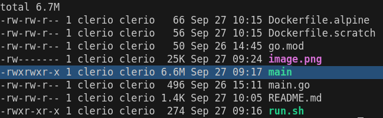

# Description

This small project aims to build a simple GO application using two approaches of base images: `alpine` and `scratch`.

One thing to notice is that, for **scratch** images you have to put everything on your own, because it comes empty without any utilitary binary. It wpuld be suitible for use cases where you  need a very tiny sized *Docker* image, for instance you can **NOT** *exec* into your `scratch` running container. `Alpine` images on the other end are bigger than `scracth` images because they have binaries other than your application binary, with that said you can for instance *exec* into it, because OS linux basic binaries comes out of the box. 

# How to

## Building the application

To ensure the portability of the binary we disabled CGO by setting it to zero `CGO_ENABLED=0`, it ensures that the Go build process will not use any C libraries, resulting in a fully statically linked binary. This is useful for creating portable binaries that do not depend on any external libraries at runtime.

    CGO_ENABLED=0 GOOS=linux go build -a -installsuffix cgo -o main .

## Buidling the images

### scratch
    
    docker image build -t my-image-scratch -f Dockerfile.scratch .

### alpine

    docker image build -t my-image-alpine -f Dockerfile.alpine .

# Result

At the time that I built the images this was the outcome.

With this it can be assumed that `scratch` images have less than 1MB, since our application binary is arround 6.6MB of size. And you can guess the size of the isolated `alpine` image based on this hypothetical math.

Check the image below for cleared details:

